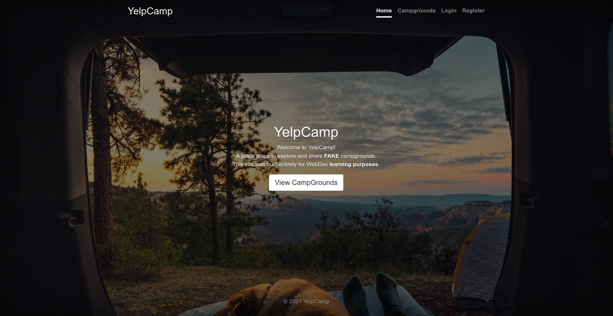

# Welcome to Campground Probe

By applying the knowledge from the web dev courses I took, I built this Web App called **YelpCamp**, where it is possible to share, search and view campgrounds (similar to airbnb). This application has a full  CRUD operations Implemented, it also has authentication and the user can register their own campground. The provided address is converted to latitude and long longitude and plotted in a map through geocoding. **Note that this application was created just for learning purposes.** 

> Got o [YelpCamp](https://shielded-oasis-41712.herokuapp.com/)

This application was basically built  using:

 - HTML/CSS/JavaScript
 - EJS
 - Bootstrap v.5
 - Node and Express
 - MongoDB and Atlas for deploing 
 - Geocoding through mapbox API:

 - Authorization and validation through passport 
 
